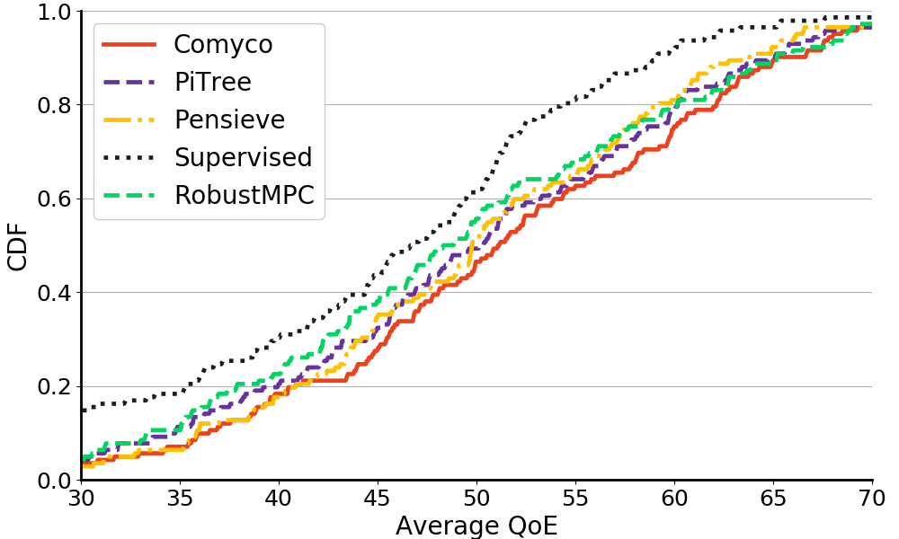

# Comyco

This is a simple Tensorflow implementation of
* [Comyco](https://arxiv.org/abs/1908.02270): Quality-Aware Adaptive Video Streaming via Imitation Learning 
* [PiTree](https://dl.acm.org/citation.cfm?doid=3343031.3350866): Practical Implementation of ABR Algorithms Using Decision Trees

## Feb. 5th Updated

[Video Description Dataset](https://github.com/godka/comyco-video-description-dataset)

## Cite

If you find this work useful to you, please cite the [conference version](https://dl.acm.org/citation.cfm?id=3351014):

```
@inproceedings{huang2019comyco,
  title={Comyco: Quality-Aware Adaptive Video Streaming via Imitation Learning},
  author={Huang, Tianchi and Zhou, Chao and Zhang, Rui-Xiao and Wu, Chenglei and Yao, Xin and Sun, Lifeng},
  booktitle={Proceedings of the 27th ACM International Conference on Multimedia},
  pages={429--437},
  year={2019},
  organization={ACM}
}
```

or the [arXiv version](https://arxiv.org/abs/1908.02270):

```
@article{huang2019comyco,
  title={Comyco: Quality-Aware Adaptive Video Streaming via Imitation Learning},
  author={Huang, Tianchi and Zhou, Chao and Zhang, Rui-Xiao and Wu, Chenglei and Yao, Xin and Sun, Lifeng},
  journal={arXiv preprint arXiv:1908.02270},
  year={2019}
}
```

## What's Comyco

Comyco is a video quality-aware ABR approach that enormously improves the learning-based methods by tackling the issues, i.e., low sample efficiency and lacks video quality information. Comyco trains the policy via imitating expert trajectories given by the instant solver, which can not only avoid redundant exploration but also make better use of the collected samples. Meanwhile, Comyco attempts to pick the chunk with higher perceptual video qualities rather than video bitrates. To achieve this, we construct Comyco's neural network architecture, video datasets and QoE metrics with video quality features. 



## Quick Start

Steps to train and test Comyco:

### Requirements

This work is based on python3.6+. You can also use python 2.7 instead. Run the following command to install dependencies.

```
pip install numpy tensorflow tflearn sklearn swig
```

### Instant Solver

Please note that the instant solver is written by c++. To build this module, you need to install g++ first. We pre-build the module for **two** platforms, i.e., Windows (_envcpp.pyd) and Linux (_envcpp.so). The source code of instant solver is demonstrated in **cpp-windows/** and **cpp-linux/**.


For Windows users, please install Swig and Visual Studio 2017.
```
swig -c++ -python abr.i
```

For Linux users, please install Swig and type this code.
```
swig -c++ -python abr.i

g++ abr_wrap.cxx env.cpp -fPIC -shared -I /usr/include/python2.7/ -L /usr/lib/python2.7 -o _envcpp.so -O4
```

**Note**: Windows is the recommended platform.

### Pretrained model

If you have trouble on building the environment, we also publish the pretrained model for Comyco and Comyco-Pitree in **results/pretrained/**. 

Try to type these code to evaluate Comyco.

```
cd src

python rl_test.py ../results/pretrained/pretrain.ckpt
```
And, for Comyco-pitree

```
cd src

python dt_test.py ../results/pretrained/pretrain-pitree.model
```

## How to train Comyco

We provide a relatively simple Comyco which uses i)  the same network traces of Pensieve's public repo; ii) only Envivo video dataset rather than 86 video dataset; iii) single agent version. 

Detailed implementation are demonstrated in [libcomyco.py](src/libcomyco.py).
You can type these code to retrain Comyco. 

```
cd src/

python train.py
```

The model will be automatically validated and saved in **results.log** during the training process (10 epoches).

Besides, we also provide several ABR baselines, including, **Pensieve-retrained (via QoE_v)** [we exclude this work in this repo since it's somewhat a big guy.], **Supervised**, and **RobustMPC (cpp-linux/mpc.cpp)**. Comyco with single agent's training time will last about only 20 - 40 minutes if you are lucky enough.

## How to train Comyco-Pitree

Moreover, we also implement Comyco-Pitree w.r.t the original [paper](https://dl.acm.org/citation.cfm?doid=3343031.3350866). Specifically, we only use **4** critical features, i.e., last chunk's VMAF score, current buffer occupancy, average throughput, std throughput. We train Comyco-Pitree via directly imitating the expert answer generated by instant solver. Moreover, we leverage a simple yet effective entropy trick for better exploration (entropy < 0.3: randomly picks an action; entropy >= 0.3: roulette algorithm).

Surprisingly, Comyco-Pitree achieves comparable result compared with Pensieve. You can type these code to retrain Comyco-Pitree, and the trained model will be stored in **src/pitree/**.

```
cd src/
python train_dt.py
```

Unlike Comyco, the Comyco-Pitree's training time will take almost 10 - 12 hours. The visualization of Comyco-Pitree is shown like this.


## Comyco-Pitree Code

Besides, you can type these code to convert tree-model to python code.
```
cd src/

python code.py
```

The python code of pretrained Comyco-Pitree is described as follows.

```python
# src/tree/comyco-pitree.py
def predict(last_vmaf, buf, thr_avg, thr_std):
  if thr_avg <= 0.1278446540236473:
    if thr_avg <= 0.07279053330421448:
      if buf <= 5.917577266693115:
        if thr_std <= 0.006877874955534935:
          if thr_avg <= 0.048280853778123856:
            if thr_std <= 0.0019393544062040746:
              return [1723, 32, 5, 0, 0, 0]
            else:  # if thr_std > 0.0019393544062040746
              return [499, 45, 7, 3, 0, 0]
          else:  # if thr_avg > 0.048280853778123856
            if thr_avg <= 0.0658254437148571:
              return [822, 100, 4, 1, 0, 0]
            else:  # if thr_avg > 0.0658254437148571
              return [296, 83, 3, 0, 0, 0]
        else:  # if thr_std > 0.006877874955534935
          if last_vmaf <= 45.12596321105957:
            if buf <= 4.90598464012146:
              return [433, 29, 8, 1, 0, 0]
            else:  # if buf > 4.90598464012146
              return [264, 58, 8, 0, 0, 0]
          else:  # if last_vmaf > 45.12596321105957
            if buf <= 4.17020058631897:
              return [590, 355, 52, 14, 6, 0]
            else:  # if buf > 4.17020058631897
              return [81, 139, 29, 3, 0, 0]
      else:  # if buf > 5.917577266693115
        if last_vmaf <= 50.5003662109375:
          if thr_std <= 0.012222875375300646:
            if buf <= 16.24397850036621:
              return [1506, 504, 46, 9, 1, 0]
            else:  # if buf > 16.24397850036621
              return [46, 117, 4, 2, 1, 0]
          else:  # if thr_std > 0.012222875375300646
            if thr_std <= 0.027544169686734676:
              return [220, 285, 61, 9, 6, 2]
            else:  # if thr_std > 0.027544169686734676
              return [24, 47, 47, 20, 5, 5]
        else:  # if last_vmaf > 50.5003662109375
          if thr_std <= 0.026649706065654755:
            if buf <= 11.83693265914917:
              return [236, 408, 23, 4, 0, 0]
            else:  # if buf > 11.83693265914917
              return [28, 237, 13, 5, 0, 0]
          else:  # if thr_std > 0.026649706065654755
            if thr_std <= 0.05448784492909908:
              return [7, 40, 36, 10, 1, 0]
            else:  # if thr_std > 0.05448784492909908
              return [1, 3, 3, 13, 3, 3]
    else:  # if thr_avg > 0.07279053330421448
      if thr_avg <= 0.09840057790279388:
        if buf <= 4.706741571426392:
          if thr_avg <= 0.07869509980082512:
            if thr_std <= 0.00829640170559287:
              return [99, 51, 2, 1, 0, 0]
            else:  # if thr_std > 0.00829640170559287
              return [159, 152, 13, 0, 0, 0]
          else:  # if thr_avg > 0.07869509980082512
            if thr_std <= 0.0310648325830698:
              return [405, 844, 52, 3, 0, 1]
            else:  # if thr_std > 0.0310648325830698
              return [108, 94, 21, 3, 2, 0]
        else:  # if buf > 4.706741571426392
          if thr_std <= 0.022664479911327362:
            if last_vmaf <= 45.12596321105957:
              return [404, 725, 71, 18, 2, 2]
            else:  # if last_vmaf > 45.12596321105957
              return [319, 1694, 231, 30, 8, 7]
          else:  # if thr_std > 0.022664479911327362
            if thr_std <= 0.04163630120456219:
              return [127, 410, 182, 31, 8, 4]
            else:  # if thr_std > 0.04163630120456219
              return [15, 43, 56, 33, 13, 7]
      else:  # if thr_avg > 0.09840057790279388
        if buf <= 7.55860447883606:
          if thr_std <= 0.014158246573060751:
            if thr_avg <= 0.11376003548502922:
              return [82, 1215, 132, 3, 3, 3]
            else:  # if thr_avg > 0.11376003548502922
              return [65, 730, 227, 13, 1, 0]
          else:  # if thr_std > 0.014158246573060751
            if buf <= 4.824381589889526:
              return [189, 484, 117, 9, 2, 0]
            else:  # if buf > 4.824381589889526
              return [100, 561, 314, 58, 2, 2]
        else:  # if buf > 7.55860447883606
          if last_vmaf <= 68.30062484741211:
            if thr_std <= 0.024262282997369766:
              return [61, 1006, 464, 78, 17, 6]
            else:  # if thr_std > 0.024262282997369766
              return [11, 128, 164, 47, 22, 10]
          else:  # if last_vmaf > 68.30062484741211
            if thr_avg <= 0.11484575644135475:
              return [40, 243, 214, 37, 7, 3]
            else:  # if thr_avg > 0.11484575644135475
              return [43, 170, 350, 54, 12, 7]
  else:  # if thr_avg > 0.1278446540236473
    if thr_avg <= 0.2331312596797943:
      if thr_avg <= 0.17724114656448364:
        if buf <= 5.7519307136535645:
          if thr_avg <= 0.14717086404561996:
            if thr_avg <= 0.13463600724935532:
              return [38, 332, 122, 4, 0, 0]
            else:  # if thr_avg > 0.13463600724935532
              return [49, 401, 279, 22, 3, 0]
          else:  # if thr_avg > 0.14717086404561996
            if thr_std <= 0.026163360103964806:
              return [20, 271, 559, 32, 2, 0]
            else:  # if thr_std > 0.026163360103964806
              return [39, 174, 153, 59, 4, 0]
        else:  # if buf > 5.7519307136535645
          if last_vmaf <= 73.01644897460938:
            if last_vmaf <= 72.72771835327148:
              return [47, 935, 1739, 424, 99, 36]
            else:  # if last_vmaf > 72.72771835327148
              return [0, 123, 52, 3, 0, 2]
          else:  # if last_vmaf > 73.01644897460938
            if thr_std <= 0.01411156915128231:
              return [56, 254, 1056, 268, 41, 8]
            else:  # if thr_std > 0.01411156915128231
              return [73, 231, 716, 408, 86, 24]
      else:  # if thr_avg > 0.17724114656448364
        if buf <= 6.222643852233887:
          if thr_avg <= 0.20830776542425156:
            if thr_std <= 0.03913935646414757:
              return [29, 139, 491, 154, 4, 1]
            else:  # if thr_std > 0.03913935646414757
              return [16, 74, 81, 42, 4, 0]
          else:  # if thr_avg > 0.20830776542425156
            if buf <= 4.454009771347046:
              return [3, 43, 131, 58, 2, 0]
            else:  # if buf > 4.454009771347046
              return [2, 39, 131, 150, 10, 2]
        else:  # if buf > 6.222643852233887
          if last_vmaf <= 81.39078521728516:
            if last_vmaf <= 79.88356018066406:
              return [17, 213, 988, 836, 285, 98]
            else:  # if last_vmaf > 79.88356018066406
              return [0, 10, 197, 81, 6, 1]
          else:  # if last_vmaf > 81.39078521728516
            if buf <= 9.960826873779297:
              return [27, 78, 318, 482, 91, 9]
            else:  # if buf > 9.960826873779297
              return [27, 49, 157, 436, 167, 70]
    else:  # if thr_avg > 0.2331312596797943
      if thr_avg <= 0.3840642422437668:
        if thr_avg <= 0.3091009110212326:
          if buf <= 6.449643850326538:
            if thr_avg <= 0.2572721242904663:
              return [3, 30, 159, 167, 27, 3]
            else:  # if thr_avg > 0.2572721242904663
              return [6, 38, 158, 413, 100, 4]
          else:  # if buf > 6.449643850326538
            if thr_avg <= 0.2699809968471527:
              return [30, 74, 412, 889, 447, 168]
            else:  # if thr_avg > 0.2699809968471527
              return [24, 40, 230, 629, 623, 276]
        else:  # if thr_avg > 0.3091009110212326
          if buf <= 10.78861951828003:
            if buf <= 5.2605369091033936:
              return [2, 2, 51, 133, 61, 0]
            else:  # if buf > 5.2605369091033936
              return [17, 24, 95, 405, 634, 183]
          else:  # if buf > 10.78861951828003
            if buf <= 16.05392837524414:
              return [13, 23, 66, 207, 458, 290]
            else:  # if buf > 16.05392837524414
              return [4, 7, 8, 48, 112, 170]
      else:  # if thr_avg > 0.3840642422437668
        if thr_avg <= 0.48681606352329254:
          if buf <= 11.260753631591797:
            if buf <= 5.801121234893799:
              return [0, 0, 4, 30, 59, 6]
            else:  # if buf > 5.801121234893799
              return [4, 13, 22, 85, 240, 175]
          else:  # if buf > 11.260753631591797
            if last_vmaf <= 99.9715690612793:
              return [4, 9, 19, 81, 182, 270]
            else:  # if last_vmaf > 99.9715690612793
              return [11, 15, 8, 32, 83, 238]
        else:  # if thr_avg > 0.48681606352329254
          if buf <= 4.282271862030029:
            if thr_avg <= 0.5182851254940033:
              return [0, 0, 0, 2, 14, 6]
            else:  # if thr_avg > 0.5182851254940033
              return [0, 0, 1, 0, 3, 10]
          else:  # if buf > 4.282271862030029
            if thr_avg <= 0.5034493207931519:
              return [6, 0, 5, 18, 47, 185]
            else:  # if thr_avg > 0.5034493207931519
              return [15, 7, 12, 30, 71, 832]

```

## Contact Us

Please feel free to let me know if you have any questions. 

Contact: htc17@mails.tsinghua.edu.cn, 

or, 

create an issue.
